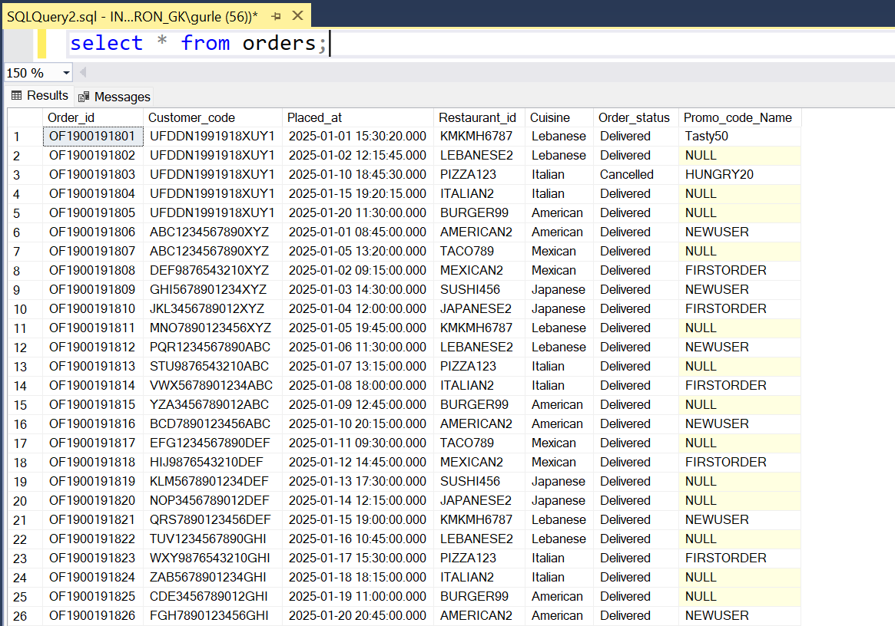
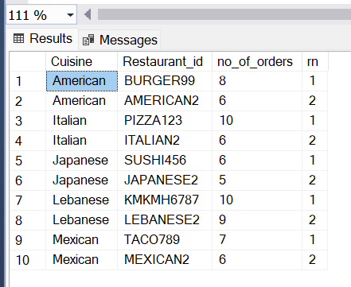
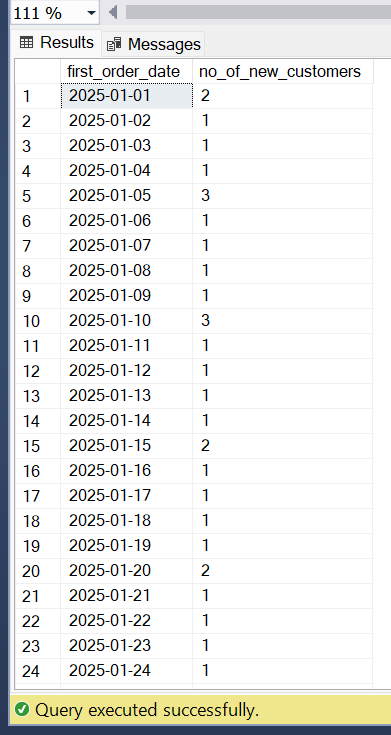
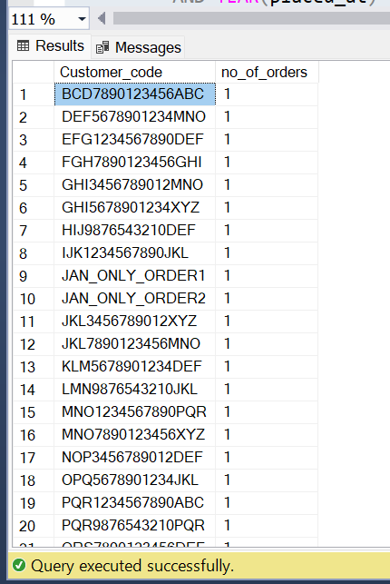
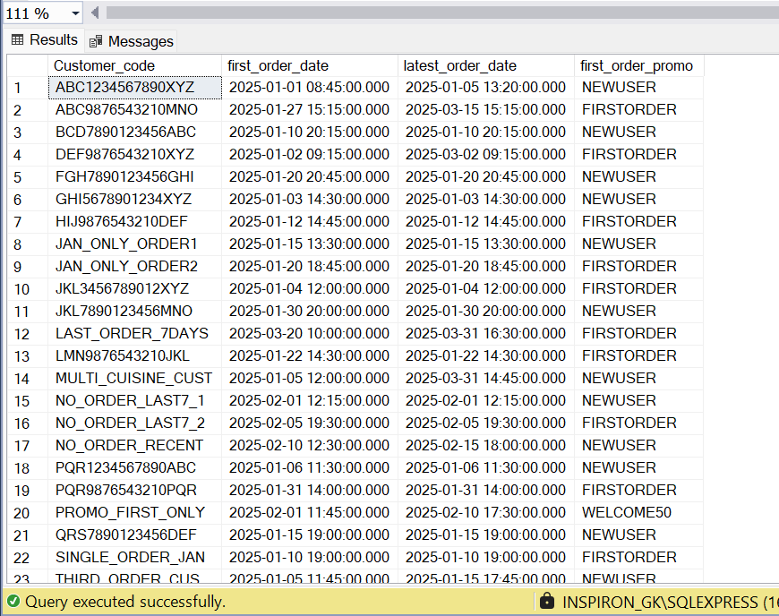
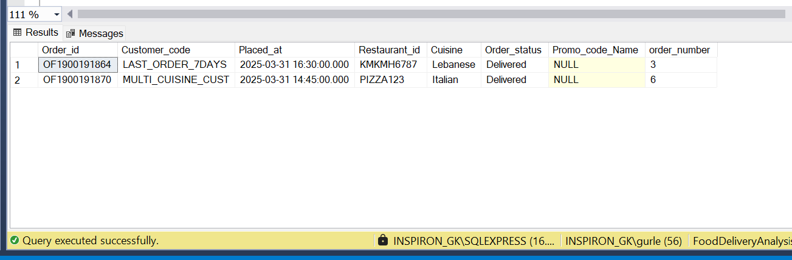
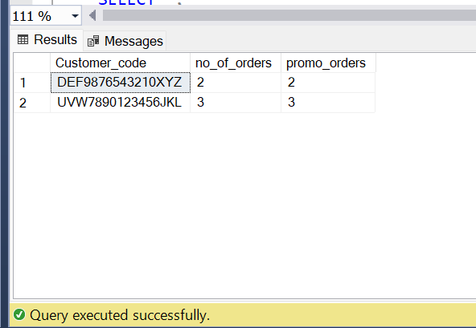
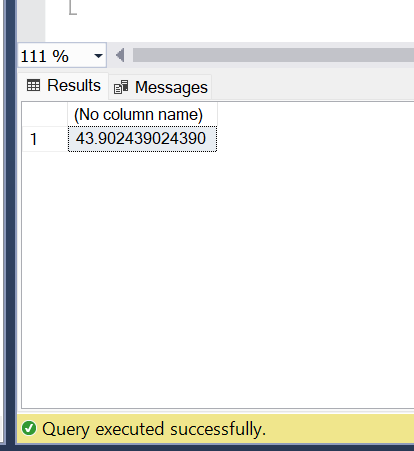

# Food Delivery Analysis

<h1>Project Overview</h1>

<h2>Objective</h2>

This project analysed a simulated food delivery dataset for <strong>Noon Food’s</strong> fictional launch in Dubai (January–March 2025). The dataset, designed to mirror realistic order journeys, promotions, and restaurant activity, was used to explore key business questions in SQL, covering customer behaviour, acquisition trends, promo effectiveness, and outlet performance. The goal was to demonstrate practical, real-world analytics skills through case-study style insights.

<h3>Tools and Methodologies</h3>

- **SQL**: Used extensively (via SQL Server) for all data exploration and insights.
- **Window functions** (`ROW_NUMBER`, `RANK`, `COUNT OVER`, etc.)
- **CTEs**, **aggregation**, and **date manipulation**
- No BI tools were used—this was entirely SQL-based to sharpen backend querying and logic formulation skills.

---

<h1>The Approach and Process</h1>

<h3>Data Preparation</h3>

A custom dataset was built representing food orders from January to March 2025. It included fields like:

- `order_id`, `customer_code`, `placed_at`, `restaurant_id`, `cuisine`, `order_status`, `promo_code_name`
  

   
  <em>Figure 1: Data Preparation Reference</em>

Edge cases (null promo codes, repeat orders, multi-cuisine restaurants) were intentionally included to ensure robust logic testing.

---

<h3>SQL Problem Breakdown</h3>

<h4>✅ 1. <strong>Top 3 Outlets by Cuisine Type (without using LIMIT/TOP)</strong></h4>

- Used `ROW_NUMBER()` with `PARTITION BY cuisine` and `ORDER BY order_count DESC` to rank restaurants.
- Filtered ranks `<= 3` to fetch the top 3 per cuisine.

   
  <em>Figure 2: Output – Top 3 Restaurants per Cuisine</em>

<h4>✅ 2. <strong>Daily New Customer Acquisition</strong></h4>

- Identified each customer's <strong>first order date</strong> using `MIN(placed_at)`.
- Grouped by this date to count new users per day.

   
  <em>Figure 3: Output – New Customers by Day</em>

<h4>✅ 3. <strong>Churned Users After a Single January Order</strong></h4>

- Selected users with <strong>only one order in January 2025</strong>.
- Ensured they did <strong>not place any further orders</strong> in Feb/Mar using `NOT IN` logic.

   
  <em>Figure 4: Output – Single-Order Customers Who Churned</em>

<h4>✅ 4. <strong>Customers With No Orders in the Last 7 Days</strong></h4>

- Identified users whose latest order was **>7 days ago**, but:
  - They were acquired **1 month ago**
  - Had a **promo code** on the first order

   
  <em>Figure 5: Output – Recently Inactive Customers</em>

<h4>✅ 5. <strong>Trigger After Every Third Order</strong></h4>

- Applied `ROW_NUMBER()` partitioned by customer.
- Used `MOD(order_number, 3) = 0` to detect third/sixth/ninth orders.
- Ensured only the latest milestone orders (placed today) were picked using `CAST(placed_at AS DATE) = CAST(GETDATE() AS DATE)`.

   
  <em>Figure 6: Output – Every 3rd Order Milestone</em>

<h4>✅ 6. <strong>Users Who Only Ordered With Promos</strong></h4>

- Grouped customers and compared:
  - Total orders vs. Orders with promo code
- Filtered customers where all orders were placed with a promo and had at least 2 orders.

   
  <em>Figure 7: Output – Promo-Only Customers</em>

<h4>✅ 7. <strong>Per cent of Organically Acquired Customers (Jan 2025)</strong></h4>

- Found users whose <strong>first order in January</strong> had no promo code.
- Calculated percentage against all customers acquired in Jan using:
- 
<pre><code class="language-sql">100.0 * COUNT(CASE WHEN promo_code IS NULL THEN 1 END) / COUNT(DISTINCT customer_code)</code></pre>

   
  <em>Figure 8: Output – Organic vs Promo-Based Acquisition</em>

<h1>End Results and Recommendations</h1> 
<h3>Insights Generated</h3> 
<ul> <li>43.9% of customers were <strong>organically acquired</strong> (first order with no promo).</li> 
<li>Some customers <strong>only ordered with promos</strong>, signalling dependency on discount-based retention.</li> 
<li>Identified a pattern of <strong>churned users</strong> post a single order, critical for re-engagement campaigns.</li> 
<li>Pinpointed high-performing restaurants by cuisine type for focused growth strategies.</li> </ul> 

<h3>Next Steps</h3> <ul> <li>Build a dashboard version of this in Tableau or Power BI.</li>
<li>Extend analysis to <strong>customer lifetime value</strong>, <strong>churn prediction</strong>, and <strong>promo ROI</strong>.</li> 
<li>Integrate external datasets like <strong>restaurant ratings</strong> or <strong>delivery times</strong> to enhance depth.</li> </ul> 

